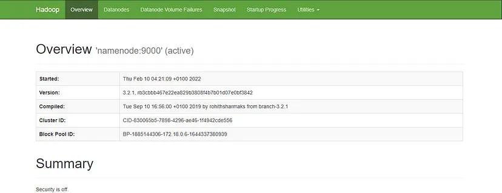

# ClusterYARN-Hadoop

Este repositorio es un ejemplo de instalación de un clúster de Hadoop usando Docker y ejecución de un conteo de palabras con MapReduce.

## 1️⃣ Lo primero que haremos será clonar un repositorio de un tercero que contiene un contenedor de Hadoop con el siguiente comando:

```bash
git clone https://github.com/big-data-europe/docker-hadoop.git
```

Este es el paso clave para descargar las imágenes de Hadoop e iniciar los contenedores.

```bash
cd docker-hadoop
```
```bash
docker-compose up -d
```

Este paso tomará tiempo para que docker descargue todas las imágenes y configure los ajustes de Hadoop. Una vez que la configuracion esté hecha, si ejecutamos:
```bash
docker container ps
```
Podremos ver los contenedores que se están ejecutando.

## 2️⃣ Acceder al contenedor de nombre “namenode”, por lo que ejecutaremos lo siguiente:

```bash
docker exec -it namenode /bin/bash
```

Y después de eso estaremos dentro del contenedor y nos aparecerá algo como:
`*root@fc0365888754:/#*`

Si ejecutamos:
```bash
hdfs dfs -ls /
```
estando dentro del contenedor, podemos encontrarnos una carpeta, de nombre “/rmstate”, lo que haremos será crear otra que lleve de nombre “user” con el siguiente comando:
```bash
hdfs dfs -mkdir -p /user/root
```
por lo que si ejecutamos
```bash
hdfs dfs -ls /
```
podremos ver que se ha creado una carpeta de nombre “user” que usaremos mas adelante.

## 3️⃣ (Opcional) Abrir el navegador y conectar la URL del namenode

Para este paso tendremos que salir del contenedor o abrir una nueva terminal que nos situe dentro de la carpeta “docker-hadoop”, y ejecutaremos:
```bash
ifconfig
```

Copiaremos la direccion IP del contenedor namenode, y depues ejecutamos el siguiente comando:
```bash
docker container ls
```
y nos despegará nuestros contenedores, copiaremos el puerto del contenedor namenode y los agregaremos al final de la IP en una ventana del navegador.

La direccion completa queda algo asi: 127.0.0.1:9870 y en el navegador nos aparecerá algo asi:


## 4️⃣ ¡Tiempo de contar palabras!

Descargaremos un archivo de jar para probar MapReduce y lo haremos con el siguiente comando que ejecutaremos dentro de nuestra carpeta “docker-hadoop”. Podemos descargarlo con:
```bash
wget https://repo1.maven.org/maven2/org/apache/hadoop/hadoop-mapreduce-examples/2.7.1/hadoop-mapreduce-examples.2.7.1-sources.jar
```
o si tenemos cualquier problema lo podemos descargar directamente desde el navegador, accediendo a:
https://repo1.maven.org/maven2/org/apache/hadoop/hadoop-mapreduce-examples/2.7.1/
y buscando y descargando a mano el archivo `hadoop-mapreduce-examples.2.7.1-sources.jar`.

Ahora vamos a tranferir ese archivo al contenedor namenode con el siguiente comando:
```bash
docker cp hadoop-mapreduce-examples-2.7.1-sources.jar namenode:/tmp/
```

Ahora crearemos un archivo de texto `ejemplo.txt` y escribimos dentro lo que queramos. Lo ideal es pegar un texto medianamente largo de ejemplo para contar las palabras.

Después de agregar texto al archivo y guardarlo, lo copiaremos al contenedor namenode con el siguiente comando:
```bash
docker cp ejemplo.txt namenode:/tmp
```

Ahora, iremos dentro del contenedor con el comando que usamos en el paso 2:
```bash
docker exec -it namenode /bin/bash
```

Si hacemos:
```bash
cd /tmp/
ls
```

Dentro de los elementos que nos aparecen podremos ver nuestro `ejemplo.txt`

Ahora, cargaremos `ejemplo.txt` a una direccion HDFS y para eso, necesitamos crear una carpeta para entrada en donde cargaremos el archivo:
```bash
hdfs dfs -mkdir /user/root/input
hdfs dfs -put ejemplo.txt
```

OPCIONAL: Si queremos desplegar el texto en la terminal para verificar que se cargó el archivo, ejecutamos:
```bash
hdfs dfs -cat /user/root/ejemplo.txt
```
y nos debería de desplegar el texto de nuestro archivo.

## 5️⃣🏁 Ejecutar ejemplo de MapReduce con el siguiente comando:

```bash
hadoop jar hadoop-mapreduce-examples-2.7.1-sources.jar org.apache.hadoop.examples.WordCount input output
```

Tardará tiempo pero una vez finalizado, podemos ejecutar el siguiente comando:
```bash
hdfs dfs -cat /user/root/output/*
```
Y nos debería de desplegar las palabras encontradas y el número de veces que se repite en el texto.
